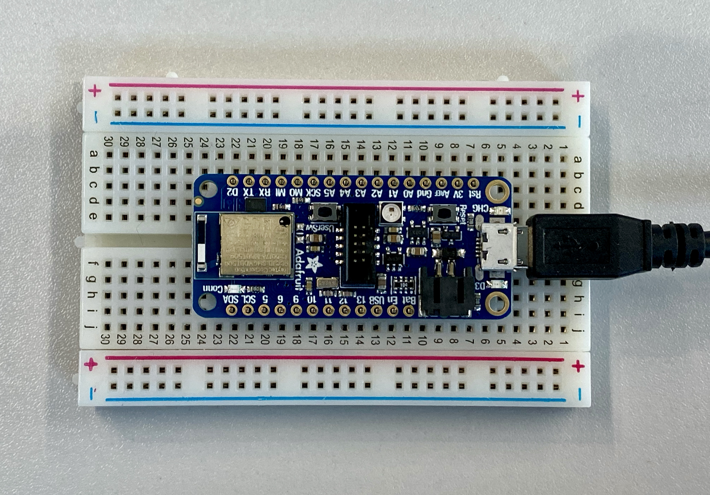

# Adafruit Express Feather nRF52840


 
- Bluetooth Low Energy and native USB support
- 'All-in-one' Arduino-compatible + Bluetooth Low Energy with built in USB plus battery charging
- Arduino IDE support
- Cortex-M4 processor
- nRF52832 projects downward compatible
- Pre-programed the chip with our UF2 bootloader

### Install Adafruit nRF52 BSP via the Arduino Board Manager

1. Download and install the Arduino IDE (At least v1.6.12)
2. Start the Arduino IDE
3. Go into Preferences
4. Add https://www.adafruit.com/package_adafruit_index.json as an 'Additional Board Manager URL'. This'll add compatability and example libraries to your Arduino IDE.
5. Restart the Arduino IDE
6. Open the Boards Manager from the Tools -> Board menu and install 'Adafruit nRF52 by Adafruit'
7. Once the BSP is installed, select 'Adafruit Bluefruit nRF52 Feather' from the Tools -> Board menu, which will update your system config to use the right compiler and settings for the nRF52.

## Hookup and Pins

### Power Pins

- __3V__: used to supply 3.3V power to external sensors, breakouts or Feather Wings
- __LIPO Input__ (Bat):  Voltage supply from the optional rechargeable cell. Can be connected via JST PH connector.
- __VREG Enable__ (En): Can be set to GND to disable the 3.3V output. By default set to HIGH.
- __USB Power__ (USB): Supplies voltage from USB (4.5-5.2V)

### Analog Inputs

- 6 analog pins (A0–A5)
- 2 ADC pins (AREF, VIVD)

__AREF__ (A7): optional external analog reference. <br>
__VIDV__ (A6): allows measurement of battery charge. Can be used as an output. 

### PWM Output

Any GPIO pin can be configured as PWM.

### I2C Pins

- Require external pullup resistors to function. Not present by default
- All Adafruit breakouts normally have pullups, hence this likely won't be an issue

### User Switches

- A general purpose switch is accessible via D7
- On board reset, press this button to force USB bootloader mode

### SWD Connector

- Long header at center board
- For advanced debugging or to reprogram the board using a 1.27mm SWD cable

### LEDs 

There are 3 basic LEDs on the board

1. __D3__: general red LED. Can be used for any desired purpose. Used as a status indicator.
2. __CONN__: blue LED. Indicates connection status for bluetooth
3. __CHG__: indicates a charging battery if connected to a USB power supply

The feather has an integrated RGB light called the __RGB Neo Pixel__. It's color can be configured via code as PIN_NEOPIXEL. It is a good way to test if the board is setup correctly.

```c++
void setup() {
  pinMode(LED_BUILTIN, OUTPUT);
}
void loop() {
  digitalWrite(LED_BUILTIN, HIGH);   // turn the LED on (HIGH is the voltage level)
  delay(1000);                       // wait for a second
  digitalWrite(LED_BUILTIN, LOW);    // turn the LED off by making the voltage LOW
  delay(1000);                       // wait for a second
}
```
